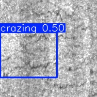
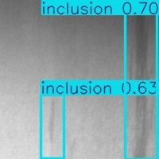
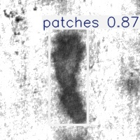

# AI Visual Inspection for Manufacturing Defect Detection

An end-to-end computer vision project using YOLOv8 to detect surface defects in manufacturing materials.

## 🔍 Problem
Manual inspection on the shop floor is time-consuming and inconsistent. This project explores how AI-based visual inspection can automate defect detection and improve quality control.

## 💡 Motivation
During my co-op, I built a gauge to verify correct Belleville washer assembly orientation. This made me think — can computer vision automate such inspection tasks?

This project is my first step toward applying AI in manufacturing environments.

## What this project does
- Converts XML annotations to YOLO format  
- Trains a YOLOv8 model on NEU-DET dataset  
- Runs inference on new images  
- Saves annotated predictions  

## Tech Stack
- Python  
- YOLOv8 (Ultralytics)  
- PyTorch  
- OpenCV  
- Google Colab (GPU training)  

## Results
- Precision: **0.706**  
- Recall: **0.692**  
- mAP@50: **0.748**  
- mAP@50-95: **0.396**

## Sample Outputs

### Crazing Detection

### Inclusion Detection

### Patches Detection

---
